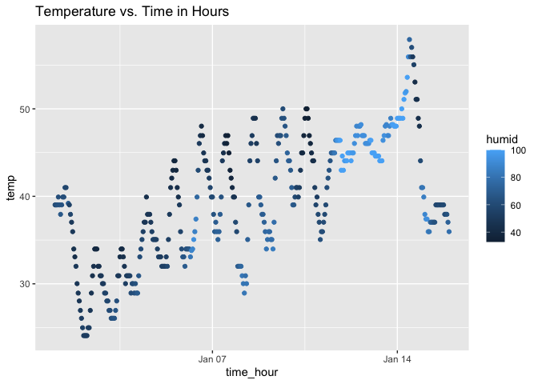

P8105 Homework 1
================
Grace Santos
09-18-23

This document will involve all problems associated with HW 1 for Data
Science (P8105).

## Problem 1

The following problem focuses on the use of inline R code, plotting and
the behavior of `ggplot` for different variables.

``` r
#Loading the `moderndive` library and the `early_january_weather` datasets

library(moderndive)

data("early_january_weather")
```

A description of the `early_january_weather` dataset can be found below:

To first identify the number of variables contained within this dataset,
I performed the following function:

``` r
ncol(early_january_weather)
```

    ## [1] 15

From this, we now know that this dataset includes a total of 15
variables. They are entitled: origin, year, month, day, hour, temp,
dewp, humid, wind_dir, wind_speed, wind_gust, precip, pressure, visib,
time_hour.

Next, the total number of observations were found using the function
below:

``` r
nrow(early_january_weather)
```

    ## [1] 358

This result shows that there are 358 total observations within the data
set.

``` r
#To continue with my data observation analysis, I loaded the tidyverse library in order to pull information about different variables and eventually plot the given data as well. 
library(tidyverse)
```

    ## ── Attaching core tidyverse packages ──────────────────────── tidyverse 2.0.0 ──
    ## ✔ dplyr     1.1.3     ✔ readr     2.1.4
    ## ✔ forcats   1.0.0     ✔ stringr   1.5.0
    ## ✔ ggplot2   3.4.3     ✔ tibble    3.2.1
    ## ✔ lubridate 1.9.2     ✔ tidyr     1.3.0
    ## ✔ purrr     1.0.2     
    ## ── Conflicts ────────────────────────────────────────── tidyverse_conflicts() ──
    ## ✖ dplyr::filter() masks stats::filter()
    ## ✖ dplyr::lag()    masks stats::lag()
    ## ℹ Use the conflicted package (<http://conflicted.r-lib.org/>) to force all conflicts to become errors

By taking a closer look at the data, we can determine the following
information about the provided data set variables:

- For all data observations, the following variables: origin, year and
  month all have the same values. This implies that each data point that
  was collected was gathered from an origin point that can be
  abbreviated as ‘EWR’, during the month of January, in the year 2013.
- The values for the day variable range between 1, 15 and the hour
  variable values ranged between 0, 23.
- The temperatures ranged from 24.08, 57.92 degrees.
- Dewpoint and humidity were measured and varied from 8.96, 53.06 and
  32.86, 100 respectively.
- The maximum precipitation was measured as 0.19
- The provided information for wind included data on wind speed,
  direction, and wind gusts. Although for many of these data
  observations, there were instances of missing or zero-valued data
  points within these variable categories.
- The atmospheric pressure was recorded in this dataset as well, however
  it also includes missing values.
- Visibility was also included and ranged from valuing between 0.12, 10

**Overall, the mean temperature was 39.5821229 degrees.**

A scatterplot of temperature vs. time is shown below. A pdf version of
the generated plot will be saved within the project folder.

``` r
ggplot(early_january_weather, aes(x = time_hour, y = temp, color = humid)) + geom_point()+ ggtitle("Temperature vs. Time in Hours")
```

<!-- -->

``` r
ggsave("hw1_scatterplot.pdf")
```

    ## Saving 7 x 5 in image
